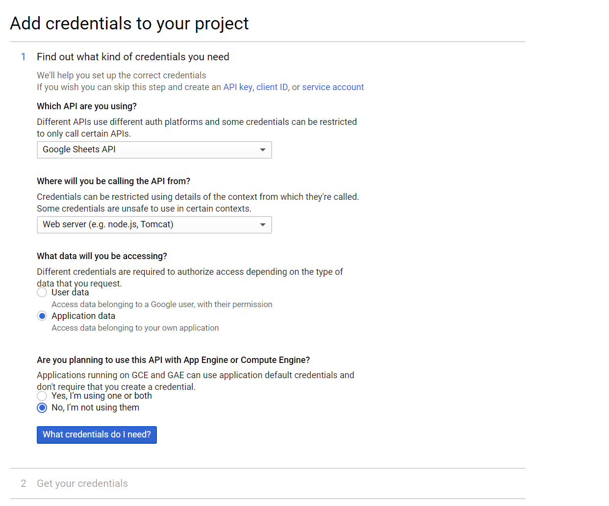
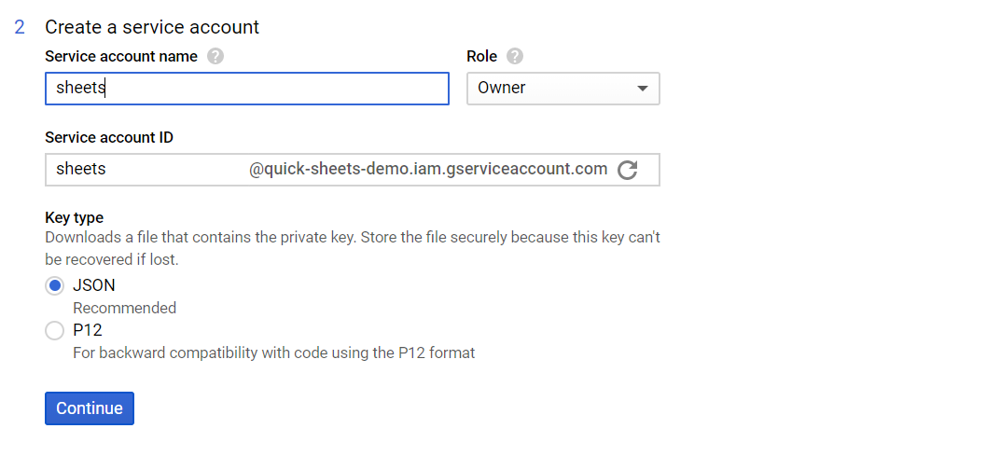
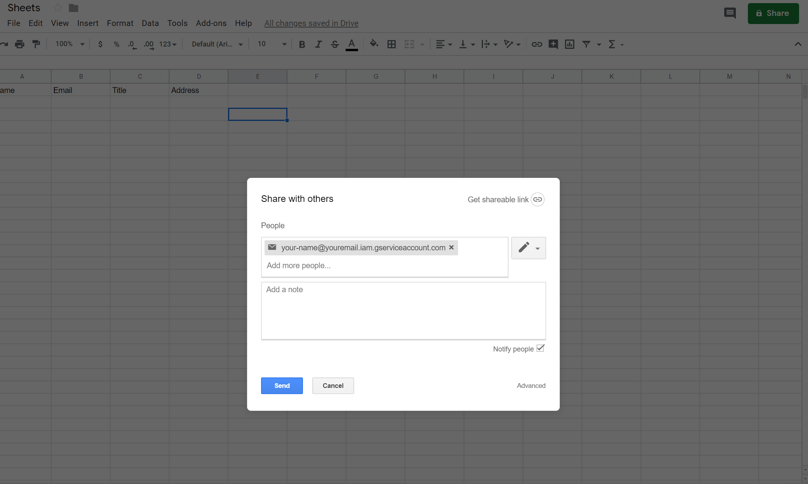
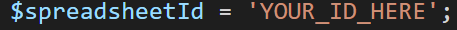

# Steps to set up Google Sheets API

### 1. Create project on https://console.developers.google.com/apis/dashboard.

### 2. Click "ENABLE APIS AND SERVICES" and enable the "Google Sheets API"

### 3. Click "CREATE CREDENTIALS" and select following values:

Which API are you using? "Google Sheets API"

Where will you be calling the API from? "Web server"

What data will you be accessing? "Application data"

Are you planning to use this API with App Engine or Compute Engine? "No, I’m not using them"



### 4. Click "What credentials do I need?"

Service account name: Enter anything here

Role: Project > Owner



### 5. Click Continue to start file download

Rename downloaded json file to credentials.json and add to same folder as export.php.

### 6. Allow client_email access to your spreadsheet

Open credentials.json and copy email address for "client_email".

Go to your Google spreadsheet and click "Share"

Add the client_email and click "Send".



### 7. Add your Spreadsheet Id to export.php

Go to your Google Spreadsheet and copy the ID (the ID comes before "/edit")
https://docs.google.com/spreadsheets/d/[SPREADSHEET_ID]/edit

Update the \$spreadsheetId variable in export.php.



### 7. Submit your HTML form to export.php

```
<form method="POST" action="export.php">
...
</form>
```

**Security note: You should deny direct access to credentials.json by using .htaccess or moving outside of public_html**
